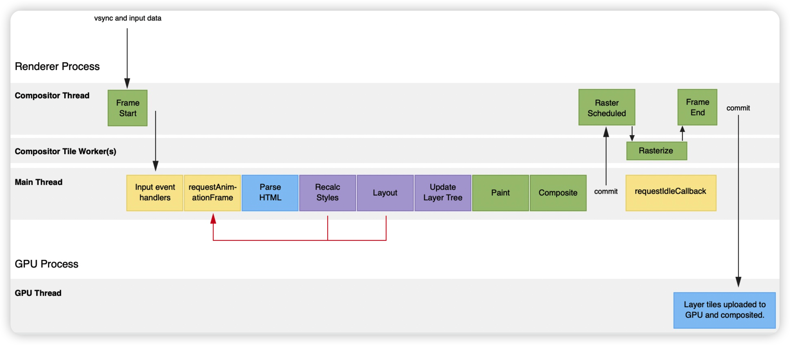
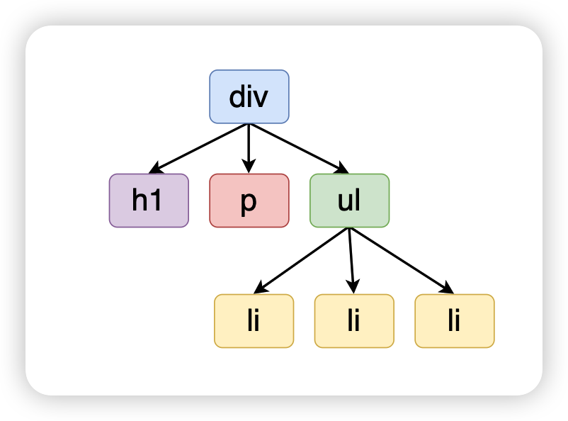
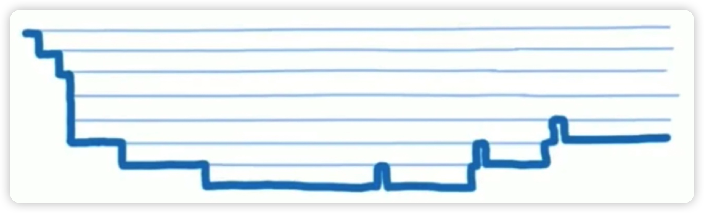
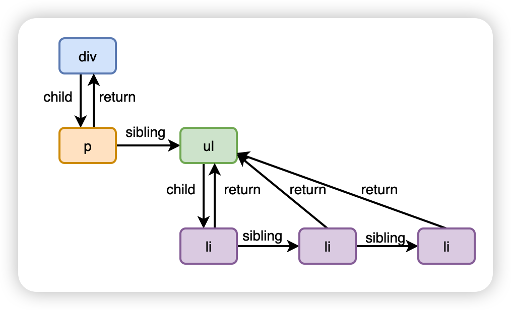
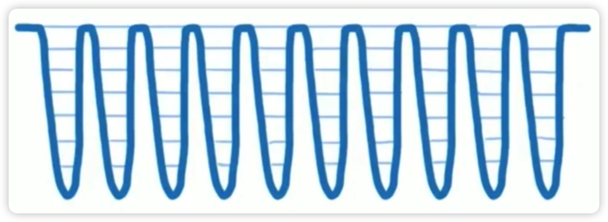

# React overall architecture

> Interview question: Have you understood the architecture of React? What advantages does the new Fiber architecture have over the previous Stack architecture?

**Standard and simple answer**

> Stack architecture uses recursion when comparing virtual DOM trees, and the calculation will consume a lot of time.
>
> The new Fiber architecture uses linked lists, which can implement time slicing and prevent JS calculations from taking up too much time and causing browsing problems.
>
> The device is experiencing frame loss.

React v15 and the previous architecture are called Stack architecture. Starting from v16, React has reconstructed the overall architecture. The new architecture is called Fiber architecture. Compared with the old architecture, the biggest feature of the new architecture is that it can achieve time slice.

- Problems with old architecture?
- Solution ideas for new architecture

## Problems with old architecture

> React is the preferred way to build large, responsive web applications with JavaScript

What are the situations that cause our web application to not respond quickly?

To sum up, there are actually two major types of scenarios that limit quick response:

- When you need to perform a lot of calculations or the performance of the device itself is insufficient, the page will experience frame drops and freezes. This is essentially caused by the bottleneck of the CPU.
- When performing I/O, you need to wait for the data to be returned before performing subsequent operations. During the waiting process, you cannot respond quickly. This situation actually comes from the bottleneck of I/O.

### CPU bottleneck

When we usually browse the web, the web page is actually drawn by the browser, just like a painter drawing.


The web pages we usually browse often have some moving things in them, such as carousels, blinds, etc. The essence is that the browser is constantly drawing.

Currently, the refresh rate of most devices is 60 FPS, which means that it needs to be drawn 60 times in 1 second, 1000ms / 60 = 16.66ms, which means that the browser needs to draw a frame every 16.66ms.

When the browser draws a frame, it actually has a lot of things to do:



The tasks in the picture above are called "rendering pipelines". Every time the pipeline is executed, it generally requires the above steps, but it does not mean that all tasks need to be executed every time:

- When the geometric properties (such as length, width) of DOM elements are modified through JS or CSS, the complete rendering pipeline will be triggered. This situation is called reflow (reflow)
- When the modified properties do not involve geometric properties (such as fonts, colors), the Layout and Layer processes in the pipeline will be omitted. This situation is called redrawing.
- When modifying "properties that do not involve rearrangement or redrawing (such as the transform attribute)", the Layout, Layer, and Print processes in the pipeline will be omitted, and only the drawing work of the composition thread will be performed. This situation is called composition.

Sort by performance: Composition > Redraw > Reflow

As mentioned before, the browser drawing frequency is 16.66ms per frame, but executing JS and the rendering pipeline are actually executed on the same thread, which means that if the execution time of JS is too long, the next page cannot be rendered in time. Frame, which means that the page is dropped, and the manifested phenomenon is that the page is stuck.

This problem existed before Reactv16, where JS code took too long to execute. In React, it is necessary to calculate the entire virtual DOM tree. Although it is calculated at the JS level, it saves a lot of time compared to directly operating the DOM. However, recalculating the entire virtual DOM tree every time will cause the error of each frame. The execution time of JS code is too long, resulting in animations and some real-time updates not receiving timely responses, resulting in stuck visual effects.

Suppose we have the following DOM hierarchy:



Then the structure converted into a virtual DOM object is roughly as follows:

```js
{
   type: "div",
   props : {
     id: "test",
     children : [
       {
         type: "h1",
         props : {
           children : "This is a title"
         }
       }
       {
         type: "p",
         props : {
           children : "This is a paragraph"
         }
       },{
         type: "ul",
         props : {
           children : [{
             type: "li",
             props : {
               children : "apple"
             }
           },{
             type: "li",
             props : {
               children : "banana"
             }
           },{
             type: "li",
             props : {
               children : "pear"
             }
           }]
         }
       }
     ]
   }
}
```

Before the React v16 version, when comparing two virtual DOM trees, it was necessary to traverse the above structure. At this time, only recursion could be used, and this recursion could not be interrupted. One road would go to black, thus This causes JS execution time to be too long.



This architecture model is officially called the Stack architecture model, because it uses recursion and will constantly open new function stacks.

### I/O bottleneck

For front-end development, the main I/O bottleneck is network latency.

Network delay is an objective phenomenon, so how to reduce the impact of this phenomenon on users? The answer given by the React team is: to integrate the research results of human-computer interaction into the UI.

Users' perception of lag is different. Even if there is only a slight delay in the input box, the user will think it is very lag. Suppose it is loading a list, even if the loading takes several seconds, the user will not feel lag.

For React, all operations come from re-rendering caused by changes in independent variables. We only need to give different priorities to different operations.

Specifically, it mainly includes the following three points:

- Give different priorities to the "independent variable changes" caused by different operations
- All priorities are scheduled uniformly, and the "highest priority updates" are processed first
- If the update is in progress (entering virtual DOM-related work) and a "higher priority update" occurs at this time, the current update in the middle will be processed first.

To achieve the above three points, the underlying layer of React needs to be able to implement:

- Scheduler for scheduling priorities
- Scheduling algorithm corresponding to the scheduler
- Support the implementation of interruptible virtual DOM

So whether it is to solve the CPU bottleneck or the I/O bottleneck, the underlying requirement is to implement the Time Slice

## Solution ideas for new architecture

### Solving CPU bottlenecks

Starting from React v16, the official team officially quoted the concept of Fiber, which is a way to describe UI through linked lists. In essence, you can also regard it as an implementation of virtual DOM.

> Rather than thinking of "Virtual DOM" as a technology, it's more of a pattern, and people often mean different things when they refer to it. In the world of React, the term "Virtual DOM" is often associated with [React Elements](https://react.docschina.org/docs/rendering-elements.html) because they are objects that represent user interfaces . React also uses an internal object called "fibers" to store additional information about the component tree. The above two are also considered part of the "Virtual DOM" implementation in React.

Fiber is essentially an object, but the difference from the previous React elements is that the objects are connected in a linked list structure. child points to the child element, sibling points to the sibling element, and return points to the parent element.

As shown below:



One of the biggest advantages of using a linked list structure is that the process can be interrupted when reconciling the entire tree.

When it is found that one frame time is no longer enough, JS cannot continue to be executed and the next frame needs to be rendered, the execution of JS will be interrupted at this time and the next frame will be rendered first. After rendering is completed, come back and complete the JS calculations that were not completed last time.



The official also provides a comparison example between Stack architecture and Fiber architecture: https://claudiopro.github.io/react-fiber-vs-stack-demo/

The following is the relevant code to create Fiber objects in the React source code:

```js
const createFiber = function (tag, pendingProps, key, mode) {
  //Create an instance object of the fiber node
  return new FiberNode(tag, pendingProps, key, mode)
}

function FiberNode(tag, pendingProps, key, mode) {
  //Instance
  this.tag = tag
  this.key = key
  this.elementType = null
  this.type = null
  this.stateNode = null // Map the real DOM

  //Fiber
  // The upper, lower, and front fibers are related in the form of a linked list.
  this.return = null
  this.child = null
  this.sibling = null
  this.index = 0

  this.ref = null
  this.refCleanup = null
  //Related to hook
  this.pendingProps = pendingProps
  this.memoizedProps = null
  this.updateQueue = null
  this.memoizedState = null
  this.dependencies = null

  this.mode = mode

  // Effects
  this.flags = NoFlags
  this.subtreeFlags = NoFlags
  this.deletions = null

  this.lanes = NoLanes
  this.childLanes = NoLanes

  this.alternate = null
  // ...
}
```

### Solving I/O bottlenecks

Scheduler has been introduced since React v16, which is used to schedule the priority of tasks.

UI = f(state):

- Calculate UI based on changes in independent variables
- Execute specific host environment APIs based on UI changes

Before React v16:

- Reconciler: vdom implementation, calculating UI changes based on changes in independent variables
- Renderer: Responsible for rendering UI changes to the host environment

Starting from React v16, there is an additional component:

- Scheduler: the priority of scheduling tasks. High-priority tasks will enter the Reconciler first.
- Reconciler: vdom implementation, calculating UI changes based on changes in independent variables
- Renderer: Responsible for rendering UI changes to the host environment

In the new architecture, Reconciler's update process has also changed from the previous recursion to an "interruptible loop process."

```js
function workLoopConcurrent{
   // If there are still tasks and there is remaining time in the time slice
   while(workInProgress !== null && !shouldYield()){
     performUnitOfWork(workInProgress);
   }
}

function shouldYield(){
   // Is the current time greater than the expiration time?
   //where deadline = getCurrentTime() + yieldInterval
   // yieldInterval is the time interval preset by the scheduler, the default is 5ms
   return getCurrentTime() >= deadline;
}
```

Each loop will call shouldYield to determine whether the current time slice has enough remaining time. If there is not enough remaining time, the execution of the reconciler will be suspended, the main thread will be returned to the rendering pipeline, and the rendering operation of the next frame will be performed. The rendering work is completed. Then, wait for the next macro task to execute the subsequent code.

## Answers to real questions

> Question: Have you understood the architecture of React? What advantages does the new Fiber architecture have over the previous Stack architecture?
>
> Reference answer:
>
> React v15 and its previous architectures:
>
> - Reconciler: Implementation of VDOM, responsible for calculating UI changes based on changes in independent variables
> - Renderer: Responsible for rendering UI changes into the host environment
>
> This architecture is called Stack architecture. In Reconciler, the mount component will call mountComponent, and the update component will call updateComponent. Both methods will recursively update sub-components. Once the update process starts, it cannot be interrupted midway.
>
> However, as the scale of applications gradually increases, the previous architectural model can no longer meet the demand for "quick response" and is mainly limited by the following two aspects:
>
> - CPU bottleneck: Since VDOM uses a recursive method when comparing differences, JS calculations will consume a lot of time, resulting in visual lags in animations and some content that needs to be updated in real time.
> - I/O bottleneck: Since various update tasks based on changes in "independent variables" have no concept of priority, there is a slight delay in some update tasks (such as text box input), which is also true for users. It is very sensitive and will cause the user to feel stuck.
>
> The new architecture is called Fiber architecture:
>
> - Scheduler: the priority of scheduling tasks. High-priority tasks will enter the Reconciler first.
> - Reconciler: Implementation of VDOM, responsible for calculating UI changes based on changes in independent variables
> - Renderer: Responsible for rendering UI changes into the host environment
>
> First, the concept of Fiber is introduced, which describes a DOM node through an object. However, the difference from the previous solution is that each Fiber object is connected in series through a linked list. Point to child elements through child, point to sibling elements through sibling, and point to parent elements through return.
>
> In the new architecture, the update process in Reconciler changes from recursive to an "interruptible loop process". Each loop will call shouldYield to determine whether the current TimeSlice has remaining time. If there is no remaining time, the update process will be suspended, the main thread will be returned to the rendering pipeline, and the execution will continue until the next macro task. This solves the CPU bottleneck problem.
>
> In addition, the Scheduler scheduler is introduced in the new architecture to schedule the priority of tasks, thereby solving the I/O bottleneck problem.


> 题目：是否了解过 React 的架构？新的 Fiber 架构相较于之前的 Stack 架构有什么优势？
>
> 参考答案：
>
> React v15及其之前的架构：
>
> - Reconciler（协调器）：VDOM 的实现，负责根据自变量变化计算出 UI 变化
> - Renderer（渲染器）：负责将 UI 变化渲染到宿主环境中
>
> 这种架构称之为 Stack 架构，在 Reconciler 中，mount 的组件会调用 mountComponent，update 的组件会调用 updateComponent，这两个方法都会递归更新子组件，更新流程一旦开始，中途无法中断。
>
> 但是随着应用规模的逐渐增大，之前的架构模式无法再满足“快速响应”这一需求，主要受限于如下两个方面：
>
> - CPU 瓶颈：由于 VDOM 在进行差异比较时，采用的是递归的方式，JS 计算会消耗大量的时间，从而导致动画、还有一些需要实时更新的内容产生视觉上的卡顿。
> - I/O 瓶颈：由于各种基于“自变量”变化而产生的更新任务没有优先级的概念，因此在某些更新任务（例如文本框的输入）有稍微的延迟，对于用户来讲也是非常敏感的，会让用户产生卡顿的感觉。
>
> 新的架构称之为 Fiber 架构：
>
> - Scheduler（调度器）：调度任务的优先级，高优先级任务会优先进入到 Reconciler
> - Reconciler（协调器）：VDOM 的实现，负责根据自变量变化计算出 UI 变化
> - Renderer（渲染器）：负责将 UI 变化渲染到宿主环境中
>
> 首先引入了 Fiber 的概念，通过一个对象来描述一个 DOM 节点，但是和之前方案不同的地方在于，每个 Fiber 对象之间通过链表的方式来进行串联。通过 child 来指向子元素，通过 sibling 指向兄弟元素，通过 return 来指向父元素。
>
> 在新架构中，Reconciler 中的更新流程从递归变为了“可中断的循环过程”。每次循环都会调用 shouldYield 判断当前的 TimeSlice 是否有剩余时间，没有剩余时间则暂停更新流程，将主线程还给渲染流水线，等待下一个宏任务再继续执行。这样就解决了 CPU 的瓶颈问题。
>
> 另外在新架构中还引入了 Scheduler 调度器，用来调度任务的优先级，从而解决了 I/O 的瓶颈问题。
