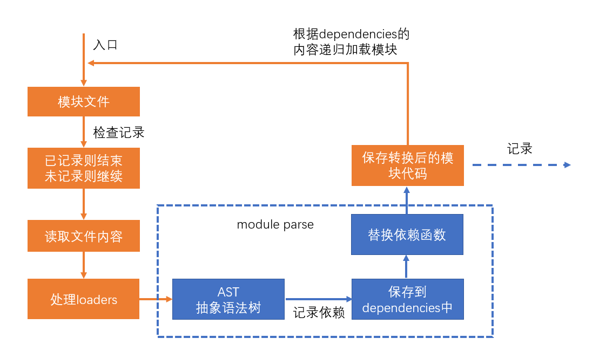
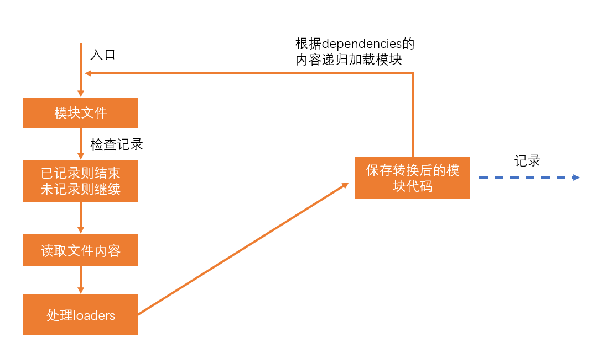

# Performance Optimization

性能优化主要体现在三个方面：

**构建性能**

这里所说的构建性能，是指在**开发阶段的构建性能**，而不是生产环境的构建性能。开发中每修改一次就会 Rebuild，而部署到生产 build 一次即可.

优化的目标，**是降低从打包开始，到代码效果呈现所经过的时间**

构建性能会影响开发效率。构建性能越高，开发过程中时间的浪费越少

**传输性能**

传输性能是指，打包后的 JavaScript 代码传输到浏览器经过的时间

在优化传输性能时要考虑到：

1. 总传输量：所有需要传输的 JavaScript 文件的内容加起来，就是总传输量，重复代码越少，总传输量越少
2. 文件数量：当访问页面时，需要传输的 JavaScript 文件数量，文件数量越多，http 请求越多，响应速度越慢
3. 浏览器缓存：JavaScript 文件会被浏览器缓存，被缓存的文件不会再进行传输

**运行性能**

运行性能是指，JavaScript 代码在浏览器端的运行速度。它主要取决于我们如何书写高性能的代码

> 例如，有一行代码你在写的时候，for 循环需要执行 10k 次，你可以先写下，为了保证程序可以正常运行起来，后续发现性能问题后可以再从此入手，降低到 1k、100、甚至 10 次。

**永远不要过早的关注于性能**，因为你在开发的时候，无法完全预知最终的运行性能，过早的关注性能会极大的降低开发效率

---

性能优化主要从上面三个维度入手

**性能优化没有完美的解决方案，需要具体情况具体分析**

## 减少模块解析 --- 构建性能

### 什么叫做模块解析？



模块解析包括：抽象语法树分析、依赖分析、模块语法替换

### 不做模块解析会怎样？



如果某个模块不做解析，该模块经过 loader 处理后的代码就是最终代码。

如果没有 loader 对该模块进行处理，该模块的源码就是最终打包结果的代码。

如果不对某个模块进行解析，可以缩短构建时间

### 哪些模块不需要解析？

模块中无其他依赖：一些已经打包好的第三方库，比如 jquery

### 如何让某个模块不要解析？

配置`module.noParse`，它是一个正则，被正则匹配到的模块不会解析

```js
module.exports = {
  mode: 'development',
  devtool: 'source-map',
  module: {
    noParse: /node_modules/,
  },
}
```

## 优化 loader 性能 --- 构建性能

### 进一步限制 loader 的应用范围

思路是：对于某些库，不使用 loader

例如：babel-loader 可以转换 ES6 或更高版本的语法，可是有些库本身就是用 ES5 语法书写的，不需要转换，使用 babel-loader 反而会浪费构建时间

lodash 就是这样的一个库

> lodash 是在 ES5 之前出现的库，使用的是 ES3 语法

通过 `module.rule.exclude` 或 `module.rule.include` ，排除或仅包含需要应用 loader 的场景

```js
module.exports = {
  module: {
    rules: [
      {
        test: /\.js$/,
        exclude: /lodash/,
        use: 'babel-loader',
      },
    ],
  },
}
```

如果暴力一点，甚至可以排除掉`node_modules`目录中的模块，或仅转换`src`目录的模块

```js
module.exports = {
  module: {
    rules: [
      {
        test: /\.js$/,
        exclude: /node_modules/,
        //或
        // include: /src/,
        use: 'babel-loader',
      },
    ],
  },
}
```

> 这种做法是对 loader 的范围进行进一步的限制，和 noParse 不冲突，想想看，为什么不冲突

### 缓存 loader 的结果

我们可以基于一种假设：如果某个文件内容不变，经过相同的 loader 解析后，解析后的结果也不变

于是，可以将 loader 的解析结果保存下来，让后续的解析直接使用保存的结果

`cache-loader`可以实现这样的功能

```js
module.exports = {
  module: {
    rules: [
      {
        test: /\.js$/,
        use: ['cache-loader', ...loaders],
      },
    ],
  },
}
```

有趣的是，`cache-loader`放到最前面，却能够决定后续的 loader 是否运行

实际上，loader 的运行过程中，还包含一个过程，即`pitch`

> 在 Webpack 中，Loader 的 `pitch` 方法是一个可选的特殊方法，用于在 Loader 链中的上游 Loader 执行之前被调用。`pitch` 方法允许 Loader 拦截上游 Loader 的执行，并提供一个机会来直接返回结果，跳过后续 Loader 的执行。
>
> 当 Webpack 构建过程中遇到一个模块，Webpack 会从配置的 Loader 链中按顺序逐个执行 Loader 来处理该模块。在这个过程中，每个 Loader 都会被调用，以对模块进行转换或处理。
>
> 但是，在实际执行 Loader 链之前，Webpack 会首先从后往前遍历 Loader 链中的每个 Loader，并检查它们是否定义了 `pitch` 方法。如果某个 Loader 定义了 `pitch` 方法，Webpack 将跳过后续的 Loader 执行，并直接调用该 `pitch` 方法。

```js
function loader(source) {
  return `new source`
}

loader.pitch = function (filePath) {
  // 接受一个文件路径
  // 可返回可不返回
  // 如果返回，返回源代码
}

module.exports = loader
```


如图，通常我们会认为，源代码在 loaders 内的流向是 3 -> 2 -> 1。但实际上在开始这个流程之前，还会把文件路径传递给 `loader1.pitch`，如果没有返回结果那么就会交给 `loader2.pitch`，以此类推，然后开启我们熟悉的 3 -> 2 -> 1 的过程。

那么如果有返沪结果就会如图所示，`loader1.pitch` 有返回结果则整个流程结束，`loader2.pitch` 有返回结果则会交给 `loader1`。`cache-loader`便是以此实现缓存。

`cache-loader`还可以实现各自自定义的配置，具体方式见文档

### 为 loader 的运行开启多线程

`thread-loader`会开启一个线程池，线程池中包含适量的线程

它会把后续的 loader 放到线程池的线程中运行，以提高构建效率

由于后续的 loader 会放到新的线程中，所以，后续的 loader 不能：

- 使用 webpack api 生成文件
- 无法使用自定义的 plugin api
- 无法访问 webpack options

> 在实际的开发中，可以进行测试，来决定`thread-loader`放到什么位置

**特别注意**，开启和管理线程需要消耗时间，在小型项目中使用`thread-loader`反而会增加构建时间

## 分包 --- 传输性能

**什么是分包**

将一个整体的代码，分布到不同的打包文件中

**为什么要分包**

1. 减少公共代码，降低总体积 --- 特别是一些大型第三方库
2. 充分利用浏览器缓存

**什么时候要分包**

1. 多个 chunks 引入了公共模块
2. 公共模块体积较大或者较少变动

**如何分包**

1. 手动分包
2. 自动分包

对于以上，可以参考以下情形

```js
// a.js

import _ from 'lodash'
```

```js
// b.js

import _ from 'lodash'
```

```js
// webpack.config.js
module.exports = {
  mode: 'development',
  mode: 'development',
  devtool: 'source-map',
  entry: {
    main: './src/a.js',
    other: './src/b.js',
  },
}
```

可以预想，打包出来以后会分出两个文件，里面都会包含到 `lodash` 的源码。这其实是冗余的，可以单独地将 `lodash` 的源码提成一个文件，这样可以避免储存一样的代码，减少体积、同时浏览器还可以很好的缓存下来，下次访问的时候如果需要 `lodash` 直接加载本地缓存即可。

### 手动分包

#### 基本原理

手动分包的总体思路是：

1. 先单独的打包公共模块


公共模块会被打包成为动态链接库(dll Dynamic Link Library)，并生成资源清单。当代码运行到需要公共模块的时候就会从资源清单里找到对应的资源路径去获取，而不会把这段代码也放在当前运行的文件内。

2. 根据入口模块进行正常打包

打包时，如果发现模块中使用了资源清单中描述的模块，则不会形成下面的代码结构

```js
//源码，入口文件index.js
import $ from 'jquery'
import _ from 'lodash'
_.isArray($('.red'))
```

由于资源清单中包含`jquery`和`lodash`两个模块，因此打包结果的大致格式是：

```js
;(function (modules) {
  //...
})({
  // index.js文件的打包结果并没有变化
  './src/index.js': function (module, exports, __webpack_require__) {
    var $ = __webpack_require__('./node_modules/jquery/index.js')
    var _ = __webpack_require__('./node_modules/lodash/index.js')
    _.isArray($('.red'))
  },
  // 由于资源清单中存在，jquery的代码并不会出现在这里
  './node_modules/jquery/index.js': function (module, exports, __webpack_require__) {
    module.exports = jquery
  },
  // 由于资源清单中存在，lodash的代码并不会出现在这里
  './node_modules/lodash/index.js': function (module, exports, __webpack_require__) {
    module.exports = lodash
  },
})
```

#### 步骤：打包公共模块

1. 单独打包公共模块，暴露变量名

```js
// webpack.dll.config.js
module.exports = {
  mode: 'production',
  entry: {
    jquery: ['jquery'],
    lodash: ['lodash'],
  },
  output: {
    filename: 'dll/[name].js',
    library: '[name]',
  },
}
```

2. 利用`DllPlugin`生成资源清单

```js
// webpack.dll.config.js
const webpack = require('webpack')

module.exports = {
  plugins: [
    new webpack.DllPlugin({
      path: path.resolve(__dirname, 'dll', '[name].manifest.json'), //资源清单的保存位置
      name: '[name]', //资源清单中，暴露的变量名
    }),
  ],
}
```

在运行 `webpack --config webpack.dll.config.js` 后，即可完成公共模块打包。这个时候就可以看到 dist 目录下有 dll 文件夹，里面包含了 lodash 和 jquery 的代码。

#### 步骤：使用公共模块

1. 在 html 页面中手动引入公共模块

```html
<!-- index.html -->

<script src="./dll/jquery.js"></script>
<script src="./dll/lodash.js"></script>
```

2. 重新设置`clean-webpack-plugin`

如果使用了插件`clean-webpack-plugin`，为了避免它把公共模块清除，需要做出以下配置

```js
new CleanWebpackPlugin({
  // 要清除的文件或目录
  // 排除掉dll目录本身和它里面的文件
  cleanOnceBeforeBuildPatterns: ['**/*', '!dll', '!dll/*'],
})
```

> 目录和文件的匹配规则使用的是[globbing patterns](https://github.com/sindresorhus/globby#globbing-patterns)

3. 使用`DllReferencePlugin`控制打包结果

```js
const webpack = requrie('webpack')

module.exports = {
  plugins: [
    new webpack.DllReferencePlugin({
      manifest: require('./dll/jquery.manifest.json'),
    }),
    new webpack.DllReferencePlugin({
      manifest: require('./dll/lodash.manifest.json'),
    }),
  ],
}
```

#### 总结

**手动打包的过程**：

1. 开启`output.library`暴露公共模块
2. 用`DllPlugin`创建资源清单
3. 用`DllReferencePlugin`使用资源清单

**手动打包的注意事项**：

1. 资源清单不参与运行，可以不放到打包目录中
2. 记得手动引入公共 JS，以及避免被删除
3. 不要对小型的公共 JS 库使用

**优点**：

1. 极大提升自身模块的打包速度
2. 极大的缩小了自身文件体积
3. 有利于浏览器缓存第三方库的公共代码

**缺点**：

1. 使用非常繁琐
2. 如果第三方库中包含重复代码，则效果不太理想

### 自动分包

#### 基本原理

不同与手动分包，自动分包是从**实际的角度**出发，从一个更加**宏观的角度**来控制分包，而一般不对具体哪个包要分出去进行控制

因此使用自动分包，不仅非常方便，而且更加贴合实际的开发需要

要控制自动分包，关键是要配置一个合理的**分包策略**

有了分包策略之后，不需要额外安装任何插件，webpack 会自动的按照策略进行分包

> 实际上，webpack 在内部是使用`SplitChunksPlugin`进行分包的
> 过去有一个库`CommonsChunkPlugin`也可以实现分包，不过由于该库某些地方并不完善，到了`webpack4`之后，已被`SplitChunksPlugin`取代


从分包流程中至少可以看出以下几点：

- 分包策略至关重要，它决定了如何分包
- 分包时，webpack 开启了一个**新的 chunk**，对分离的模块进行打包
- 打包结果中，公共的部分被提取出来形成了一个单独的文件，它是新 chunk 的产物

#### 分包策略的基本配置

webpack 提供了`optimization`配置项，用于配置一些优化信息

其中`splitChunks`是分包策略的配置

```js
module.exports = {
  optimization: {
    splitChunks: {
      // 分包策略
    },
  },
}
```

事实上，分包策略有其默认的配置，我们只需要轻微的改动，即可应对大部分分包场景

1. chunks

该配置项用于配置需要应用分包策略的 chunk

我们知道，分包是从已有的 chunk 中分离出新的 chunk，那么哪些 chunk 需要分离呢

chunks 有三个取值，分别是：

- all: 对于所有的 chunk 都要应用分包策略
- async：【默认】仅针对异步 chunk 应用分包策略
- initial：仅针对普通 chunk 应用分包策略

所以，你只需要配置`chunks`为`all`即可

2. maxSize

该配置可以控制包的最大字节数

如果某个包（包括分出来的包）超过了该值，则 webpack 会尽可能的将其分离成多个包

但是不要忽略的是，分包的**基础单位是模块**，如果一个完整的模块超过了该体积，它是无法做到再切割的，因此，尽管使用了这个配置，完全有可能某个包还是会超过这个体积

另外，该配置看上去很美妙，实际意义其实不大

因为分包的目的是**提取大量的公共代码**，从而减少总体积和充分利用浏览器缓存

虽然该配置可以把一些包进行再切分，但是实际的总体积和传输量并没有发生变化

> 如果要进一步减少公共模块的体积，只能是压缩和`tree shaking`

#### 分包策略的其他配置

如果不想使用其他配置的默认值，可以手动进行配置：

- automaticNameDelimiter：新 chunk 名称的分隔符，默认值~
- minChunks：一个模块被多少个 chunk 使用时，才会进行分包，默认值 1
- minSize：当分包达到多少字节后才允许被真正的拆分，默认值 30000

#### 缓存组

之前配置的分包策略是全局的

而实际上，分包策略是基于缓存组的

每个缓存组提供一套独有的策略，webpack 按照缓存组的优先级依次处理每个缓存组，被缓存组处理过的分包不需要再次分包

默认情况下，webpack 提供了两个缓存组：

```js
module.exports = {
  optimization: {
    splitChunks: {
      //全局配置
      cacheGroups: {
        // 属性名是缓存组名称，会影响到分包的chunk名
        // 属性值是缓存组的配置，缓存组继承所有的全局配置，也有自己特殊的配置
        vendors: {
          test: /[\\/]node_modules[\\/]/, // 当匹配到相应模块时，将这些模块进行单独打包
          priority: -10, // 缓存组优先级，优先级越高，该策略越先进行处理，默认值为0
        },
        default: {
          minChunks: 2, // 覆盖全局配置，将最小chunk引用数改为2
          priority: -20, // 优先级
          reuseExistingChunk: true, // 重用已经被分离出去的chunk
        },
      },
    },
  },
}
```

很多时候，缓存组对于我们来说没什么意义，因为默认的缓存组就已经够用了

但是我们同样可以利用缓存组来完成一些事情，比如对公共样式的抽离

```js
module.exports = {
  optimization: {
    splitChunks: {
      chunks: 'all',
      cacheGroups: {
        styles: {
          test: /\.css$/, // 匹配样式模块
          minSize: 0, // 覆盖默认的最小尺寸，这里仅仅是作为测试
          minChunks: 2, // 覆盖默认的最小chunk引用数
        },
      },
    },
  },
  module: {
    rules: [{ test: /\.css$/, use: [MiniCssExtractPlugin.loader, 'css-loader'] }],
  },
  plugins: [
    new CleanWebpackPlugin(),
    new HtmlWebpackPlugin({
      template: './public/index.html',
      chunks: ['index'],
    }),
    new MiniCssExtractPlugin({
      filename: '[name].[hash:5].css',
      // chunkFilename是配置来自于分割chunk的文件名
      chunkFilename: 'common.[hash:5].css',
    }),
  ],
}
```

#### 配合多页应用

虽然现在单页应用是主流，但免不了还是会遇到多页应用

由于在多页应用中需要为每个 html 页面指定需要的 chunk，这就造成了问题

```js
new HtmlWebpackPlugin({
  template: './public/index.html',
  chunks: ['index~other', 'vendors~index~other', 'index'],
})
```

我们必须手动的指定被分离出去的 chunk 名称，这不是一种好办法

幸好`html-webpack-plugin`的新版本中解决了这一问题

```shell
npm i -D html-webpack-plugin@next
```

做出以下配置即可：

```js
new HtmlWebpackPlugin({
  template: './public/index.html',
  chunks: ['index'],
})
```

它会自动的找到被`index`分离出去的 chunk，并完成引用

#### 原理

自动分包的原理其实并不复杂，主要经过以下步骤：

1. 检查每个 chunk 编译的结果
2. 根据分包策略，找到那些满足策略的模块
3. 根据分包策略，生成新的 chunk 打包这些模块（代码有所变化）
4. 把打包出去的模块从原始包中移除，并修正原始包代码

在代码层面，有以下变动

1. 分包的代码中，加入一个全局变量，类型为数组，其中包含公共模块的代码
2. 原始包的代码中，使用数组中的公共代码

## 代码压缩

1. **为什么要进行代码压缩**

减少代码体积；破坏代码的可读性，提升破解成本；

2. **什么时候要进行代码压缩**

生产环境

3. **使用什么压缩工具**

目前最流行的代码压缩工具主要有两个：`UglifyJs`和`Terser`

`UglifyJs`是一个传统的代码压缩工具，已存在多年，曾经是前端应用的必备工具，但由于它不支持`ES6`语法，所以目前的流行度已有所下降。

`Terser`是一个新起的代码压缩工具，支持`ES6+`语法，因此被很多构建工具内置使用。`webpack`安装后会内置`Terser`，当启用生产环境后即可用其进行代码压缩。

因此，我们选择`Terser`

### Terser

在`Terser`的官网可尝试它的压缩效果

> Terser 官网：https://terser.org/

### webpack+Terser

webpack 自动集成了 Terser

如果你想更改、添加压缩工具，又或者是想对 Terser 进行配置，使用下面的 webpack 配置即可

```js
const TerserPlugin = require('terser-webpack-plugin')
const OptimizeCSSAssetsPlugin = require('optimize-css-assets-webpack-plugin')
module.exports = {
  optimization: {
    // 是否要启用压缩，默认情况下，生产环境会自动开启
    minimize: true,
    minimizer: [
      // 压缩时使用的插件，可以有多个
      new TerserPlugin(),
      new OptimizeCSSAssetsPlugin(),
    ],
  },
}
```

## tree shaking --- 传输性能

压缩可以移除模块内部的无效代码。
tree shaking 可以移除模块之间的无效代码.

### 背景

某些模块导出的代码并不一定会被用到

```js
// myMath.js
export function add(a, b) {
  console.log('add')
  return a + b
}

export function sub(a, b) {
  console.log('sub')
  return a - b
}
```

```js
// index.js
import { add } from './myMath'
console.log(add(1, 2))
```

tree shaking 用于移除掉不会用到的导出。此处即为 `sub`，最后的打包文件不会包含 `sub` 函数的内容。

### 使用

`webpack2`开始就支持了`tree shaking`

只要是生产环境，`tree shaking`自动开启

### 原理

webpack 会从入口模块出发寻找依赖关系

当解析一个模块时，webpack 会根据 ES6 的模块导入语句来判断，该模块依赖了另一个模块的哪个导出

webpack 之所以选择 ES6 的模块导入语句，是因为 ES6 模块有以下特点：

1. 导入导出语句只能是顶层语句
2. import 的模块名只能是字符串常量
3. import 绑定的变量是不可变的

这些特征都非常有利于分析出稳定的依赖

在具体分析依赖时，webpack 坚持的原则是：**保证代码正常运行，然后再尽量 tree shaking**

所以，如果你依赖的是一个导出的对象，由于 JS 语言的动态特性，以及`webpack`还不够智能，为了保证代码正常运行，它不会移除对象中的任何信息

因此，我们在编写代码的时候，**尽量**：

- 使用`export xxx`导出，而不使用`export default {xxx}`导出
- 使用`import {xxx} from "xxx"`导入，而不使用`import xxx from "xxx"`导入

依赖分析完毕后，`webpack`会根据每个模块每个导出是否被使用，标记其他导出为`dead code`，然后交给代码压缩工具处理

代码压缩工具最终移除掉那些`dead code`代码

### 使用第三方库

某些第三方库可能使用的是`commonjs`的方式导出，比如`lodash`

又或者没有提供普通的 ES6 方式导出

对于这些库，`tree shaking`是无法发挥作用的

因此要寻找这些库的`es6`版本，好在很多流行但没有使用的`ES6`的第三方库，都发布了它的`ES6`版本，比如`lodash-es`

### 作用域分析

`tree shaking`本身并没有完善的作用域分析，可能导致在一些`dead code`函数中的依赖仍然会被视为依赖

> ```js
> // a.js
>
> import { chunk } from 'lodash-es'
>
> export function add(a, b) {
>   console.log('add')
>   return a + b
> }
>
> export function myChunk(arr, num) {
>   console.log('myChunk')
>   return chunk(arr, num)
> }
> ```
>
> ```js
> // b.js
>
> import { add } from './a'
> ```
>
> 可以看到 `b` 只用了 `add`，所以 `a` 里面剩下的函数其实都可以不需要打包，但是 `a` 里面却又有函数 `myChunk` 引用了 `chunk`，这导致 webpack 不得不连带着 `lodash` 的 `chunk` 函数一起打包进去，因为他无法完善分析出依赖情况，即使 `myChunk` 是 `dead code`。

插件`webpack-deep-scope-plugin`提供了作用域分析，可解决这些问题

### 副作用问题

webpack 在`tree shaking`的使用，有一个原则：**一定要保证代码正确运行**

在满足该原则的基础上，再来决定如何`tree shaking`

因此，当`webpack`无法确定某个模块是否有副作用时，它往往将其视为有副作用

因此，某些情况可能并不是我们所想要的

```js
//common.js
var n = Math.random()

//index.js
import './common.js'
```

虽然我们根本没用有`common.js`的导出，但`webpack`担心`common.js`有副作用，如果去掉会影响某些功能，因此他不会对这部分代码做出`tree shaking`

如果要解决该问题，就需要标记该文件是没有副作用的

在`package.json`中加入`sideEffects`

```json
{
  "sideEffects": false
}
```

有两种配置方式：

- false：当前工程中，所有模块都没有副作用。注意，这种写法会影响到某些 css 文件的导入
- 数组：设置哪些文件拥有副作用，例如：`["!src/common.js"]`，表示只要不是`src/common.js`的文件，都有副作用

> 这种方式我们一般不处理，通常是一些第三方库在它们自己的`package.json`中标注

### css tree shaking

`webpack`无法对`css`完成`tree shaking`，因为`css`跟`es6`没有半毛钱关系

因此对`css`的`tree shaking`需要其他插件完成

例如：`purgecss-webpack-plugin`

> 注意：`purgecss-webpack-plugin`对`css module`无能为力

## 懒加载

在刚进入首页的时候，很多 js 代码实际上还用不上。为了减少传输损耗，可以动态的引入 js 文件，以此减少首次访问的文件传输量。

### 使用

```js
const btn = document.querySelector('button')
btn.onclick = async function () {
  //动态加载
  //import 是ES6的草案
  //浏览器会使用JSOP的方式远程去读取一个js模块
  //import()会返回一个promise   （* as obj）
  const { chunk } = await import(/* webpackChunkName:"lodash" */ 'lodash-es')
  const result = chunk([3, 5, 6, 7, 87], 2)
  console.log(result)
}
```

> `ECMAScript6` 提案引入了 `import()` 函数，它允许动态地异步加载 `JavaScript` 模块。`import()` 函数返回一个 `Promise` 对象，该 `Promise` 在模块加载和执行完成后被解析。

> `import(/* webpackChunkName:"lodash" */ "lodash-es")` 表示使用 `import()` 函数异步加载了 `lodash-es` 模块。注释 `/* webpackChunkName:"lodash" */` 是 `webpack` 特定的注释，用于为生成的异步模块定义一个名称，这里是 `lodash`。

这样的话，当按钮被点击，会重新获取一个新的 js 文件，里面包含 chunk 函数。这样就实现了异步加载。

### 进一步减小体积

现在虽然可以实现异步加载，但是对于引用的库依然要把代码全数打包。因为无法分析出哪个变量是需要使用的。为此，可以新建一个文件，然后再从该文件导出。

```js
// utils.js

export { chunk } from 'lodash-es'
```

```js
const btn = document.querySelector('button')
btn.onclick = async function () {
  //动态加载
  //import 是ES6的草案
  //浏览器会使用JSOP的方式远程去读取一个js模块
  //import()会返回一个promise   （* as obj）
  // const { chunk } = await import(/* webpackChunkName:"lodash" */"lodash-es");
  const { chunk } = await import('./util')
  const result = chunk([3, 5, 6, 7, 87], 2)
  console.log(result)
}
```

这样的话，webpack 就会先分析 utils 文件，也就知道了只需要 chunk 函数，这样就避免了打包多余代码。但这样依然很麻烦。

## gzip --- 传输效率

gzip 是一种压缩文件的算法，文件经过压缩后再传输就可以减少体积，进而提升传输效率

### B/S 结构中的压缩传输


优点：传输效率可能得到大幅提升

缺点：服务器的压缩需要时间，客户端的解压需要时间

### 使用 webpack 进行预压缩

使用`compression-webpack-plugin`插件对打包结果进行预压缩，可以移除服务器的压缩时间


